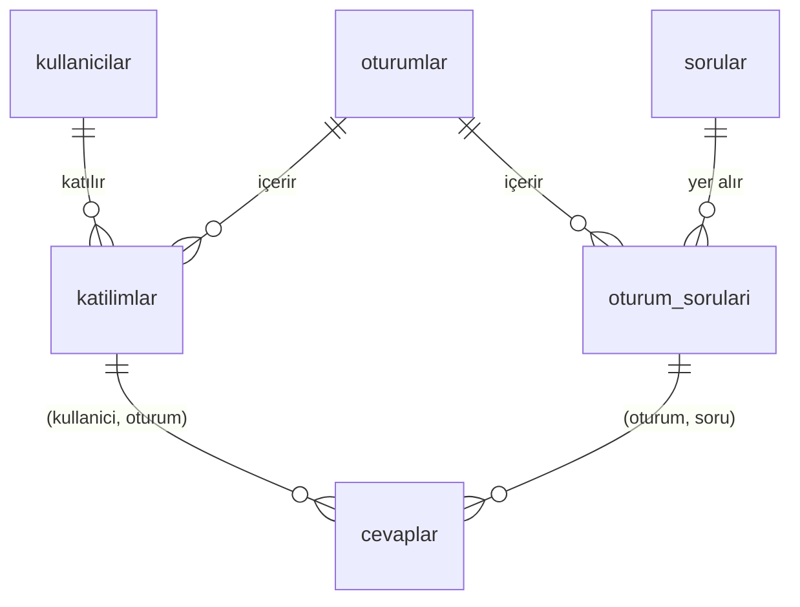

# SQLite ile Quiz Veri Tabanı

Derste kullanılan quiz sisteminin veri katmanı: kullanıcılar, quiz oturumları, sorular, katılımlar ve cevaplar SQLite üzerinde tutarlı biçimde saklanır. Üzerinde canlı takip yapılabilen küçük bir web arayüzü de vardır.

**Hazırlayan:** Yağız Efe Çiçekçisoy · 124200053

---

## Çalıştırma

Gereken: **Python 3.8+**. Komutlar proje klasöründe çalıştırılır:

```bash
pip install -r requirements.txt
python testler.py
python app.py
```

| Komut | Ne olur? |
|---|---|
| `pip install -r requirements.txt` | Arayüz için Flask'ı kurar (bir kez). |
| `python testler.py` | 29 veri bütünlüğü kontrolü yapar, hepsi `[OK]` çıkar. Veritabanını değiştirmez. |
| `python app.py` | Arayüzü başlatır: **http://127.0.0.1:5000** (durdurmak için Ctrl+C). |

**Deneme hesapları** (giriş sayfasında da yazılıdır):

| Rol | E-posta | Şifre |
|---|---|---|
| Hoca | `hoca@okul.edu.tr` | `hoca123` |
| Öğrenci | `20240008@ogrenci.edu.tr` (süren quize katılmış, henüz cevap vermemiş) | `ogrenci123` |

Hoca panelinde beklenen: 3 quiz **bitti**, w02-s01 **sürüyor** (55 öğrencinin canlı ilerlemesiyle), w02-s02 **başlamadı**.

### İncelerken bilinmesi gerekenler

1. **Hoca ve öğrenciyi aynı anda denemek için** biri http://127.0.0.1:5000, diğeri http://localhost:5000 adresinde açılmalıdır. Aynı adresteki iki sekme birbirinin girişini kapatır.
2. **Açılıştaki "örnek veri bayat" mesajı normaldir.** Örnek veride bir quiz "sürüyor" durumunda bırakıldı, böylece üç durum da veride görünür ve canlı takip dolu açılır. Bu quiz `seed.py` çalıştığı andan 5 dk önce başlamış sayılır. Proje günler sonra açılınca "günlerdir sürüyor" görünmesin diye `python app.py`, süren quiz **15 dakikadan** (quiz süresi 10 dk + 5 dk pay) uzun süredir açıksa veriyi `seed.py` ile yeniden kurar. Seed her seferinde aynı veriyi üretir.
3. **Quiz süresi 10 dakikadır.** Sayaç süre dolunca uzatmayı gösterir (`10:12 (+12 sn)`), quiz hoca **Bitir** diyene kadar sürer. Aynı anda tek quiz sürebilir: w02-s02'yi başlatmak için önce w02-s01 bitirilmelidir.
4. **Sarı kutular hata değildir.** Veritabanının reddettiği işlemler (ör. ikinci quizi başlatmak) "veri bütünlüğü kuralı" olarak açıklanır.
5. **`quiz.db` doğrudan DB Browser'da açılırsa** veri tamdır, yalnızca süren quizin geçen süresi seed anından beri işlemiş görünür. Taze süre için önce `python seed.py`.

Diğer komutlar:

```bash
python seed.py                       # veritabanını sıfırdan kurar (~2 sn, her seferinde aynı veri)
sqlite3 quiz.db ".read queries.sql"  # bütün sorguları çalıştırır
```

> Windows'ta test edildi. Mac'te `python3` gerekebilir, 5000 portu AirPlay ile çakışabilir.

---

## Proje hakkında

| Hedef (ödev) | Projede |
|---|---|
| En az 50 kullanıcı | 60 öğrenci + 1 hoca |
| 5 oturum, en az 100 farklı soru | 5 oturum × 20 soru = 100 farklı soru (SQL konulu) |
| Cevaplar kullanıcı, oturum ve soruya bağlı | 3 yabancı anahtar, 2'si bileşik |
| Başlamamış / süren / bitmiş oturum ve zamanları | 3 bitti, 1 sürüyor, 1 başlamadı |
| Canlı takip, sonuçlar, en yüksek puanlılar | `queries.sql` ve arayüz |

| Dosya | İçerik |
|---|---|
| `schema.sql` | Tablolar, kısıtlar, indeksler, trigger'lar, görünümler |
| `seed.py` + `sorular.csv` | Örnek veriyi oluşturur (sorular CSV dosyasından okunur) |
| `queries.sql` | A. kayıt sayıları · B. canlı takip · C. sonuçlar ve sıralama · D. cevaplama akışı denemesi (veriyi değiştirir) |
| `testler.py` | Veri bütünlüğü kontrolleri, sonunda her şeyi geri alır |
| `app.py`, `templates/` | Flask arayüzü: giriş, öğrenci quiz ekranı, hoca paneli, sonuçlar |
| `quiz.db` | Dolu, çalışan veritabanı |
| `rapor/Proje_Raporu.pdf` | Diyagramlar ve tasarım kararlarıyla ayrıntılı rapor |

---

## Veri modeli



| Tablo | Görevi | Önemli sütunlar |
|---|---|---|
| `kullanicilar` | Öğrenciler ve hoca | `ogrenci_no` ve `email` tekil, `sifre_hash` + `sifre_salt`, `rol`, `kayit_zamani` |
| `oturumlar` | Her biri tek bir quiz (ör. `w02-s01`) | `durum` (baslamadi / suruyor / bitti), `baslangic`, `bitis`, `planlanan_sure_sn` (600) |
| `sorular` | Soru bankası | `metin`, `secenek_a..d`, `dogru_cevap` (A–D) |
| `oturum_sorulari` | Hangi soru hangi oturumda, kaçıncı sırada | PK `(oturum_id, soru_id)`, `sira` |
| `katilimlar` | Öğrencinin quize katıldığı an | PK `(kullanici_id, oturum_id)` |
| `cevaplar` | Verilen cevap ve zamanı | `UNIQUE(kullanici_id, oturum_id, soru_id)` |

**Kurallar (hepsi veritabanında):**

| Kural | Nasıl? |
|---|---|
| Aynı soru aynı oturuma iki kez eklenemez | PK `(oturum_id, soru_id)` |
| Cevap, sorunun gerçekten bulunduğu oturuma ait olmalı | Bileşik FK `cevaplar(oturum_id, soru_id)` → `oturum_sorulari` |
| Quize katılmadan cevap verilemez | Bileşik FK `cevaplar(kullanici_id, oturum_id)` → `katilimlar` |
| Soru başına tek cevap, değiştirince satır güncellenir | UNIQUE + UPSERT |
| Yalnızca süren quize cevap verilir / değiştirilir | Trigger |
| Durum yalnızca ileri gider: başlamadı → sürüyor → bitti | Trigger |
| Durum ile zamanlar tutarlı (ör. bitti ise bitiş dolu ve ≥ başlangıç) | CHECK |
| Aynı anda tek quiz sürebilir | Kısmi benzersiz indeks |

Yabancı anahtar denetimi her bağlantıda açılır: `PRAGMA foreign_keys = ON;`

---

## Puanlama kuralı

| Cevap | Puan |
|---|---|
| Doğru | 1 |
| Yanlış | 0 (eksi puan yok) |
| Boş | 0 |

- **Oturum yüzdesi** = doğru ÷ oturumdaki soru sayısı × 100, quiz sistemindeki gibi gösterilir: `18/20 · %90`.
- **Boş:** Cevap satırı olmayan soru boş sayılır, ayrı kayıt tutulmaz.
- **Cevap değiştirme:** Quiz sürerken serbesttir, son cevap geçerlidir.
- **Genel sıralama:** Bitmiş quizlerdeki toplam doğru ÷ toplam soru. Katılınmayan quiz 0 sayılır.
- Puan tabloda saklanmaz, `v_sonuclar` görünümünde her seferinde güncel veriden hesaplanır.

---

## Kayıt sayılarının doğrulanması

`queries.sql` → A1 ve A2:

```sql
SELECT 'ogrenciler' AS tablo, COUNT(*) AS kayit FROM kullanicilar WHERE rol = 'ogrenci'
UNION ALL SELECT 'kullanicilar',    COUNT(*) FROM kullanicilar
UNION ALL SELECT 'oturumlar',       COUNT(*) FROM oturumlar
UNION ALL SELECT 'sorular',         COUNT(*) FROM sorular
UNION ALL SELECT 'oturum_sorulari', COUNT(*) FROM oturum_sorulari
UNION ALL SELECT 'katilimlar',      COUNT(*) FROM katilimlar
UNION ALL SELECT 'cevaplar',        COUNT(*) FROM cevaplar;

SELECT COUNT(DISTINCT soru_id) AS farkli_soru_sayisi FROM oturum_sorulari;
```

| öğrenci | kullanıcı | oturum | soru | oturum_sorulari | katılım | cevap | farklı soru |
|---|---|---|---|---|---|---|---|
| 60 | 61 | 5 | 100 | 100 | 212 | 3186 | 100 |

---

## Mühendislik kararları

| Karar | Neden |
|---|---|
| Oturum = tek quiz, oturum başına 20 soru | Gerçek sistemdeki "Session" tek bir quizdir. Gerçek quizler 5 soru, ama ödev 5 oturumda 100 farklı soru istiyor. |
| Quiz süresi 10 dakika | Gerçek sistemde 5 soruya 3 dk var (soru başına 36 sn). 20 soruya 10 dk soru başına 30 sn eder. |
| Kurallar veritabanında | Hangi araçla erişilirse erişilsin (Python, DB Browser) hatalı veri girilemez. Arayüz kuralları tekrar yazmaz. |
| Cevap değiştirme UPSERT ile, quiz bitince trigger ile kilit | Gerçek sistemde quiz açıkken cevap değiştirmek serbest, sonra değil. |
| Aynı anda tek quiz | Test ederken iki quizin aynı anda sürebildiği fark edildi, kısmi benzersiz indeksle kapatıldı. |
| Puan ve süre saklanmaz, görünümle hesaplanır | Türetilen bilgi saklanırsa her cevapta güncellenmesi gerekir, unutulursa çelişir (normalizasyon). |
| Şifre: PBKDF2-SHA256 + kullanıcıya özel salt | Veritabanı ele geçse bile şifreler okunamaz. |
| ENUM yerine `TEXT + CHECK` | SQLite'ta ENUM yok. En kalabalık sütun (`verilen_cevap`) zaten 1 bayt, kodlamanın kazancı birkaç KB. Okunabilirlik seçildi. |
| Örnek veride 3 bitti + 1 sürüyor + 1 başlamadı | Üç durum da veride görünsün, canlı takip ilk açılışta dolu olsun. |
| `random.seed(42)`, sorular CSV'de | Her çalıştırmada aynı veri (yeniden kurulabilir teslim). Veri ile kod ayrı. |
| Python'da değerler `?` yer tutucusuyla | SQL enjeksiyonuna karşı koruma. |
| Arayüz Flask ile, live güncelleme | En sade Python web kütüphanesi. Sayfalar saniyede bir küçük bir durum kontrolü yapar, değişiklik varsa yenilenir: hoca Başlat / Bitir dediğinde öğrenci ekranı 1 sn içinde değişir. |
| Açılışta bayat veri kontrolü (15 dk) | Bkz. "İncelerken bilinmesi gerekenler" 2. madde. Yalnızca açılışta bakılır, uygulama çalışırken veriye dokunulmaz. |
