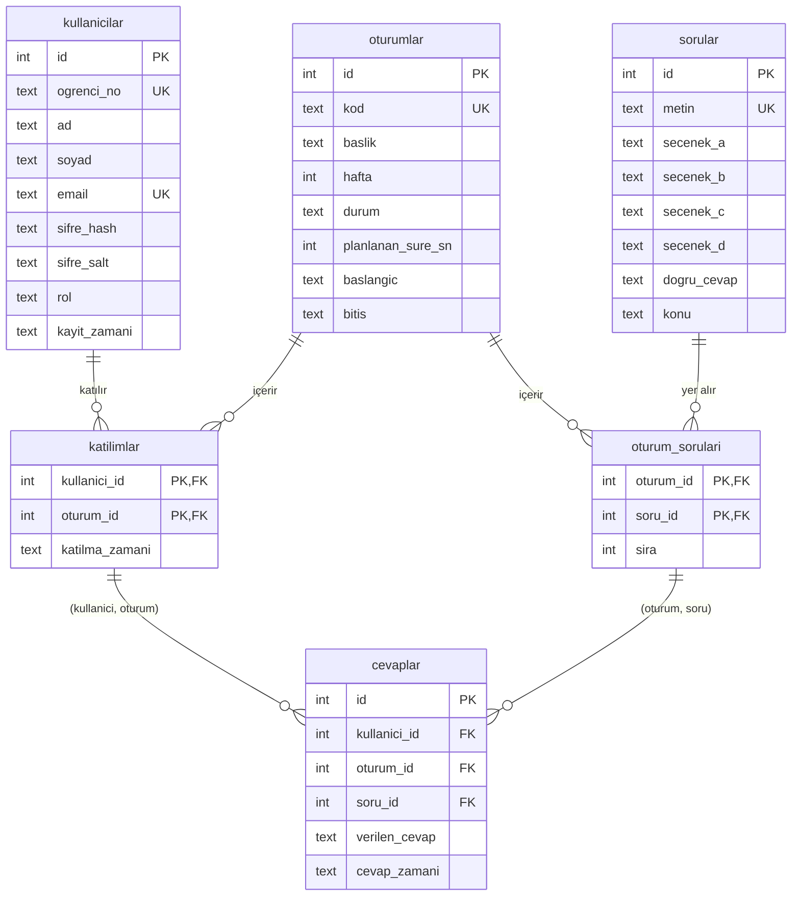

# SQLite ile Quiz Veri Tabanı

Derste kullanılan quiz sisteminin veri katmanı: kullanıcılar, quiz oturumları, sorular, katılımlar ve cevaplar SQLite üzerinde tutarlı biçimde saklanır.

| Hedef (ödev) | Durum |
|---|---|
| En az 50 kullanıcı | 60 öğrenci + 1 hoca |
| 5 oturum, en az 100 farklı soru | 5 oturum × 20 soru = 100 soru |
| Cevaplar kullanıcı, oturum ve soruya bağlı | 3 yabancı anahtar (2 bileşik) |
| Başlamamış / süren / bitmiş oturumlar ve zamanları | 3 bitti, 1 sürüyor, 1 başlamadı |

---

## Hızlı inceleme

Proje klasöründe:

```bash
pip install -r requirements.txt
python testler.py
python app.py
```

1. **`python testler.py`** → 34 veri bütünlüğü kontrolü, hepsi `[OK]`. Veritabanı değişmez.
2. **`python app.py`** → tarayıcıda **http://127.0.0.1:5000**. Deneme hesapları giriş sayfasında yazılıdır (hoca: `hoca@okul.edu.tr` / `hoca123`).
3. **Hoca panelinde beklenen görüntü:** 60 öğrenci, 5 oturum, 100 soru · w01-s01..s03 **bitti**, w02-s01 **sürüyor** (49 öğrencinin canlı ilerlemesiyle), w02-s02 **başlamadı** · ilk 10 sıralaması.
4. **Canlı akış:** Öğrenciyi aynı anda görmek için ikinci bir sekmede **http://localhost:5000** açıp `20240023@ogrenci.edu.tr` / `ogrenci123` ile girin. Hoca **Bitir / Başlat** dedikçe öğrenci ekranı 1 sn içinde değişir; öğrenci cevap verdikçe hoca paneli güncellenir.

**İncelemeden önce bilinmesi gerekenler**

1. **İki adres:** Hoca ve öğrenciyi aynı anda denemek için birini **http://127.0.0.1:5000**, diğerini **http://localhost:5000** adresinde açın. Aynı adresteki iki sekme birbirinin oturumunu kapatır. (Alternatif: farklı tarayıcı ya da gizli pencere.)
2. **Açılıştaki "örnek veri bayat" mesajı:** Örnek veride bir quizin (w02-s01) "sürüyor" durumunda olmasını istedim, çünkü ödevin istediği başlamamış, süren ve bitmiş durumların üçü de veride hazır görünsün ve canlı takip ilk açılışta dolu olsun istedim. Ancak `seed.py` bu quizi çalıştığı andan 30 sn önce başlamış olarak kaydediyor ve proje günler sonra açıldığında quiz "günlerdir sürüyor" (ör. `+250000 sn` uzatma) görünecekti. Bunu önlemek için, hocam projeyi açtığında verinin güncel olması amacıyla **5 dakikayı sınır alan bir kontrol ekledim:** `python app.py` açılırken süren quiz 5 dakikadan uzun süredir açıksa veriyi `seed.py` ile yeniden kuruyor ve terminale bunu yazıyor. Böylece quiz `0:30`'dan başlıyor. Seed her seferinde aynı veriyi ürettiği için (`random.seed(42)`) silinen önemli bir şey olmuyor, değişen tek şey süren quizin başlangıç saati. Sınırı 3 dakika yapmadım, çünkü quizin resmî süresi 3 dakika ve gerçek uzatmaları (+10, +30 sn) da bayat sayardı. Kontrol yalnızca açılışta yapılıyor, uygulama çalışırken veriye dokunulmuyor.
3. **Sayaç:** Süren quiz `0:30` civarından başlar. 3 dakika dolunca uzatmayı gösterir (`3:12 (+12 sn)`). Quiz, hoca **Bitir** diyene kadar sürer.
4. **Aynı anda tek quiz:** w02-s02'yi başlatmak için önce w02-s01'i **Bitir**'in.
5. **Sarı kutular hata değildir:** Veritabanının reddettiği işlemler sarı "veri bütünlüğü kuralı" kutusunda açıklanır.
6. **Live:** Sayfaların kendiliğinden yenilenmesi beklenen bir davranıştır. Başlat ve Bitir öğrenci ekranına 1 sn içinde yansır.
7. **Demo öğrencisi:** `20240023@ogrenci.edu.tr` / `ogrenci123`. Süren quize katılmış ama henüz cevap vermemiş.
8. **DB Browser:** `quiz.db` doğrudan açılırsa açılış kontrolü çalışmaz. Taze süre için önce `python seed.py` çalıştırın.
9. **Bilinen sınırlamalar:** Windows'ta test edildi. Mac'te `python3` gerekebilir, 5000 portu AirPlay ile çakışabilir.

---

## 1. Dosyalar

| Dosya | İçerik |
|---|---|
| `schema.sql` | Tablolar, kısıtlar, indeksler, trigger'lar ve görünümler (VIEW) |
| `seed.py` | Veritabanını sıfırdan kurar ve örnek veriyi oluşturur |
| `sorular.csv` | `seed.py`'nin okuduğu 100 SQL sorusu (4 şık, doğru cevap, konu) |
| `queries.sql` | Kayıt sayıları, canlı takip, sonuçlar, puan sıralaması ve akış denemesi |
| `testler.py` | 34 veri bütünlüğü kontrolü |
| `app.py`, `templates/` | Küçük web arayüzü (Flask) |
| `requirements.txt` | Arayüz için gereken paket (Flask) |
| `quiz.db` | Çalışan veritabanı (`seed.py` çıktısı) |
| `rapor/Proje_Raporu.pdf` | Diyagramlar ve tasarım kararlarıyla proje raporu |

---

## 2. Kurulum ve çalıştırma

**Gerekenler:** Python 3.8+ (`sqlite3` Python ile birlikte gelir). Yalnızca arayüz için Flask: `pip install -r requirements.txt`. İsteğe bağlı: [DB Browser for SQLite](https://sqlitebrowser.org/dl/) veya `sqlite3` komut satırı aracı.

Komutlar proje klasöründe çalıştırılır:

```bash
python seed.py
```
`quiz.db` silinir, `schema.sql` ile yeniden kurulur ve veri eklenir (~2 sn). `random.seed(42)` sayesinde her çalıştırmada aynı veri oluşur.

```bash
python testler.py
```
Kurallara aykırı işlemleri dener, reddedildiklerini doğrular, sonunda her şeyi geri alır (`quiz.db` değişmez).

```bash
sqlite3 quiz.db ".read queries.sql"
```
Tüm sorguları çalıştırır. DB Browser'da: **Execute SQL** → `queries.sql` dosyasını aç → sorgunun başlık satırına (`-- B1.` gibi) imleci koy → **Shift+F5**.

```bash
python app.py
```
Arayüzü başlatır → tarayıcıda **http://127.0.0.1:5000** (durdurmak için terminalde Ctrl+C).

> **Notlar**
> - `seed.py` çalışmadan önce DB Browser kapatılmalıdır (Windows açık dosyanın silinmesine izin vermez).
> - Süren oturum (w02-s01), `seed.py` çalıştırılmadan 30 sn önce başlamış kabul edilir. Kimse bitirmezse geçen süre ve uzatma artmaya devam eder; `python app.py` açılışta 5 dakikadan eskiyse veriyi yeniler.
> - `queries.sql`'in **D bölümü** veriyi değiştirir. DB Browser'da **Revert Changes** ile ya da `python seed.py` ile geri alınır.

---

## 3. Veri modeli



| Tablo | Görevi |
|---|---|
| `kullanicilar` | Öğrenciler ve hoca. Şifre düz metin değil, PBKDF2-SHA256 hash + kullanıcıya özel salt olarak saklanır. |
| `oturumlar` | Her biri tek bir quiz (ör. `w02-s01` = Week 2 · Session 1). Süre: 180 sn. |
| `sorular` | Soru bankası: metin, 4 şık, doğru cevap. |
| `oturum_sorulari` | Hangi soru hangi oturumda, kaçıncı sırada (oturumlar ↔ sorular çoka-çok ilişkisi). |
| `katilimlar` | Öğrencinin oturuma katıldığı an (cevap vermeden önce de izlenir). |
| `cevaplar` | Öğrencinin bir soruya verdiği cevap ve zamanı. |

### Kurallar

| Kural | Nasıl sağlanıyor? |
|---|---|
| Aynı soru aynı oturuma iki kez eklenemez | `oturum_sorulari` PK `(oturum_id, soru_id)` |
| Cevap, sorunun gerçekten bulunduğu oturuma ait olmalı | `cevaplar(oturum_id, soru_id)` → `oturum_sorulari` (bileşik FK) |
| Oturuma katılmadan cevap verilemez | `cevaplar(kullanici_id, oturum_id)` → `katilimlar` (bileşik FK) |
| Her soruya tek cevap satırı; cevap değişince satır güncellenir | `UNIQUE(kullanici_id, oturum_id, soru_id)` + UPSERT |
| Yalnızca süren oturuma cevap verilir / cevap değiştirilir | Trigger'lar |
| Durum yalnızca ileri gider: `baslamadi → suruyor → bitti` | Trigger |
| Durum ile zamanlar tutarlı (ör. `bitti` ise bitiş dolu ve ≥ başlangıç) | CHECK |
| Başlangıç yalnızca başlatılırken, bitiş yalnızca bitirilirken yazılır, sonradan değiştirilemez, gelecekte olamaz | Trigger |
| Katılım ve cevap zamanı quizin başlangıcından önce ya da gelecekte olamaz | Trigger'lar |
| Aynı anda tek oturum sürebilir | Kısmi benzersiz indeks `... WHERE durum = 'suruyor'` |
| E-posta (büyük/küçük harf duyarsız), öğrenci no, oturum kodu tekildir | UNIQUE |

Yabancı anahtar denetimi her bağlantıda açılır: `PRAGMA foreign_keys = ON;`

---

## 4. Puanlama kuralı

Puanlama `schema.sql` içindeki **`v_sonuclar`** görünümünde, tek bir yerde tanımlıdır.

| Cevap | Puan |
|---|---|
| Doğru | 1 |
| Yanlış | 0 (eksi puan yok) |
| Boş | 0 |

- **Oturum yüzdesi** = doğru sayısı ÷ oturumdaki soru sayısı × 100. Quiz sistemindeki gibi gösterilir: `18/20 · %90.0`
- **Boş:** Öğrencinin cevap satırı olmayan soru boş sayılır. Ayrı bir kayıt tutulmaz.
- **Cevap değiştirme:** Quiz sürerken serbesttir. Son verilen cevap geçerlidir.
- **Genel sıralama:** Bitmiş oturumlardaki toplam doğru ÷ bitmiş oturumlardaki toplam soru. Katılınmayan quiz 0 sayılır.
- Yüzdeler ve süreler tabloda **saklanmaz**, her sorguda güncel veriden hesaplanır (normalizasyon).

---

## 5. Kayıt sayılarının doğrulanması

`queries.sql` → **A1** ve **A2**:

```sql
SELECT 'ogrenciler' AS tablo, COUNT(*) AS kayit FROM kullanicilar WHERE rol = 'ogrenci'
UNION ALL SELECT 'kullanicilar',    COUNT(*) FROM kullanicilar
UNION ALL SELECT 'oturumlar',       COUNT(*) FROM oturumlar
UNION ALL SELECT 'sorular',         COUNT(*) FROM sorular
UNION ALL SELECT 'oturum_sorulari', COUNT(*) FROM oturum_sorulari
UNION ALL SELECT 'katilimlar',      COUNT(*) FROM katilimlar
UNION ALL SELECT 'cevaplar',        COUNT(*) FROM cevaplar;

SELECT COUNT(DISTINCT soru_id) AS farkli_soru_sayisi FROM oturum_sorulari;
```

| Tablo | Kayıt |
|---|---|
| ogrenciler | 60 |
| kullanicilar | 61 |
| oturumlar | 5 |
| sorular | 100 |
| oturum_sorulari | 100 |
| katilimlar | 206 |
| cevaplar | 3018 |
| **farklı soru (oturumlara atanmış)** | **100** |

---

## 6. Sorgular (`queries.sql`)

| Bölüm | Sorgular |
|---|---|
| **A. Kayıt sayıları** | A1 tablo sayıları · A2 farklı soru sayısı · A3 oturum başına soru |
| **B. Canlı takip** | B1 tüm oturumların durumu, geçen süre, uzatma · B2 süren oturumun ilerlemesi (katılımcı, cevap, tamamlanma %) · B3 soru bazında · B4 öğrenci bazında |
| **C. Sonuçlar** | C1 bir oturumun sonuçları · C2 oturum özetleri (ortalama, en yüksek, en düşük) · C3 en yüksek puanlı 10 kullanıcı · C4 en zor 5 soru |
| **D. Akış denemesi** | Süren quizi bitir → yenisini başlat → katıl → cevapla → cevabı değiştir → bitir → sonuç |

**Canlı takip:** Sorgular süren oturumu `durum = 'suruyor'` koşuluyla kendiliğinden bulur. Sorgu her çalıştırıldığında güncel veriyi yeniden okur.

---

## 7. Veri bütünlüğü testleri (`testler.py`)

34 kontrolün 34'ü beklendiği gibi sonuçlanır. Ödevin istedikleri:

| Denenen işlem | Sonuç |
|---|---|
| Olmayan kullanıcı adına cevap | Reddedilir (FOREIGN KEY) |
| Olmayan soruya cevap | Reddedilir (FOREIGN KEY) |
| Oturumda bulunmayan soruya cevap | Reddedilir (bileşik FK) |
| Aynı soruya ikinci cevap satırı | Reddedilir (UNIQUE) |
| Aynı soruya cevap değiştirme (UPSERT) | Kabul edilir, yine tek satır |

Diğerleri: zaman damgaları (başlangıçtan önce katılım, gelecek tarihli cevap, quiz saatlerini sonradan değiştirme), bitmiş/başlamamış oturuma cevap, bitmiş oturuma katılım, ikinci oturumu başlatma, durumu geri alma, tekrarlanan e-posta/öğrenci no, geçersiz şık/durum/e-posta vb.

---

## 8. Arayüz (`app.py`)

Küçük bir Flask uygulaması. Bütün kurallar veritabanında olduğu için arayüz yalnızca SQL çalıştırır. Veritabanı bir işlemi reddederse ekranda sarı bir **veri bütünlüğü kuralı** kutusu çıkar: Türkçe açıklama + veritabanının asıl mesajı.

| Ekran | Ne yapar? | Karşılığı |
|---|---|---|
| Giriş | E-posta + şifre (hash ile doğrulanır), role göre yönlendirir | — |
| Öğrenci | Süren quize katıl → şıkka tıkla (cevap kaydedilir) → istediğin kadar değiştir. Bitmiş quizlerin sonuçları: `18/20 · %90` | D2, D3/D4 (UPSERT) |
| Hoca paneli | Kayıt sayıları · oturumlar: durum, zamanlar, süre ve uzatma, **Başlat / Bitir** · canlı takip · ilk 10 | A1, B1, B2, B4, C3, D0/D1/D6 |
| Sonuçlar | Bitmiş oturumun özeti ve öğrenci sonuçları | C1, C2 |

**Canlı (live):** Sayfalar saniyede bir `/canli` adresine küçük bir soru sorar (süren quiz, katılımcı ve cevap sayısı). Bir şey değiştiyse sayfa yenilenir. Hoca **Başlat** deyince quiz öğrencilerin ekranında belirir, **Bitir** deyince kaybolur ve sonuç görünür. Süre sayacı saniye saniye işler.

**Açılış kontrolü:** `python app.py`, süren quiz 5 dakikadan uzun süredir açıksa örnek veriyi `seed.py` ile yeniden kurar (bkz. Hızlı inceleme).

**Demo:** Hoca için http://127.0.0.1:5000, öğrenci için http://localhost:5000 açın. Hoca w02-s01'i bitirip w02-s02'yi başlatır → öğrenci ekranında yeni quiz belirir → öğrenci cevap verdikçe hoca panelindeki sayılar artar.

---

## 9. Tasarım tercihleri

**ENUM ve saklama maliyeti.** Az sayıda sabit değer alan sütunlar metin yerine küçük kodlarla tutulursa yer kazanılır. SQLite'ta ENUM tipi yoktur ve saklama bit değil bayt düzeyindedir.

| Sütun | Şu an | Kod ile | Satır | Kazanç |
|---|---|---|---|---|
| `oturumlar.durum` | `'baslamadi'` 5–9 bayt | 1 bayt | 5 | ~30 bayt, önemsiz |
| `kullanicilar.rol` | `'ogrenci'` 4–7 bayt | 0–1 bayt | 61 | ~400 bayt, önemsiz |
| `cevaplar.verilen_cevap` | `'A'` 1 bayt | 1 bayt | 3018 | Yok, zaten en küçük hâli |
| Zaman sütunları | `'2026-09-25 10:00:00'` 19 bayt | 4–6 bayt | ~3300 | ~45 KB, tek anlamlı kazanç |

- En kalabalık tablo (`cevaplar`) zaten verimli. İsraf yalnızca küçük tablolarda var.
- `TEXT + CHECK (durum IN (...))` enum'un "yalnızca izin verilen değer" güvencesini sağlar.
- Kod kullanmanın bedeli okunabilirliktir (`WHERE durum = 1`, DB Browser'da `2` ve `1790668800`).
- **Karar:** Bu ölçekte okunabilirlik seçildi. Sistem büyürse önce zaman damgaları INTEGER'a (Unix zamanı), sonra durum/rol sayı koduna çevrilir.

### Alınan kararlar

**Veri modeli**

| Karar | Neden |
|---|---|
| Oturum = tek quiz (gerçek sistemdeki "Session") | Başlık, durum, başlangıç/bitiş zamanı tek bir quize karşılık gelir. Hocaya danışıldı, yanıt bekleniyor. |
| Oturum başına 20 soru | Gerçek quizler 5 soru, ama ödev 5 oturumda 100 farklı soru istiyor. Modelde soru sayısı sınırı yok. |
| Kurallar veritabanında (FK, bileşik FK, UNIQUE, CHECK, trigger) | Veriye hangi araçla (Python, DB Browser, komut satırı) erişilirse erişilsin hatalı veri girilemez. Arayüzde kural tekrar yazılmadı. |
| Cevap değiştirme = UPSERT, quiz bitince trigger ile kilit | Gerçek sistemde quiz açıkken cevap değiştirmek serbest. Öğrenci–soru başına tek satır kalır. |
| Aynı anda tek quiz (kısmi benzersiz indeks) | Test sırasında iki quizin aynı anda sürebildiği fark edildi ve kapatıldı. |
| Zaman damgaları trigger'larla korunur | Yönerge "zaman damgaları tutarlı olmalı" diyor. Yönergeyi satır satır kontrol ederken gelecek tarihli cevap ve sonradan değiştirilebilen quiz saatleri gibi açıklar bulundu ve 4 trigger ile kapatıldı. |
| Puan ve süre saklanmaz, VIEW ile hesaplanır | Türetilen bilgi saklanırsa her cevapta güncellenmesi gerekir, unutulursa çelişir (normalizasyon). |
| Şifre: PBKDF2-SHA256 + kullanıcıya özel salt | Veritabanı ele geçse bile şifreler okunamaz. |
| ENUM yerine `TEXT + CHECK` | Yukarıdaki tablo: bu ölçekte kazanç birkaç KB, okunabilirlik daha değerli. |

**Örnek veri (`seed.py`)**

| Karar | Neden |
|---|---|
| 3 bitti + 1 sürüyor + 1 başlamadı | Ödevin istediği üç durum veride hazır görünür, canlı takip ilk açılışta dolu olur. ("Süren quiz olmasın" seçeneği denendi: canlı takip boş kaldı, geri dönüldü.) |
| Bitmiş quizler tam 3 dk, uzatmasız | Sade veri. `uzatmalar` listesiyle uzatma eklenebilir. |
| Süren quiz, seed anından **30 sn** önce başlamış | Hoca ve öğrenci sekmelerini açmaya 3 dakikadan önce vakit kalsın. Öğrenci ilerlemesi buna uygun: 0–5 soru (soru başına ~9 sn). |
| `random.seed(42)` | Her çalıştırmada aynı veri: teslim yeniden kurulabilir. |
| Sorular `sorular.csv` dosyasında | Veri ile kod ayrı. Yeni soru eklemek için koda dokunmak gerekmez. |
| Python'da her değer `?` yer tutucusuyla | SQL enjeksiyonuna karşı koruma. |

**Arayüz (`app.py`)**

| Karar | Neden |
|---|---|
| Flask | Python'un en sade web kütüphanesi. Proje zaten Python kullanıyor, tek ek paket. |
| Küçük ama ödevin her maddesini gösteren 4 ekran | Ödev "küçük ve çalışan" arayüz istiyor. Her ekran bir ödev maddesine karşılık geliyor (Bölüm 8). |
| Live: saniyede bir `/canli` kontrolü, değişince yenileme | Her saniye bütün sayfayı yüklemek (5 sorgu + HTML) yerine birkaç baytlık kontrol. İlk sürümdeki 5 saniyelik tam yenilemenin yerini aldı. |
| Süre sayacı tarayıcıda | Sunucuya sormadan saniye saniye işler, 3 dk aşılınca uzatmayı gösterir. |
| Açılışta bayat veri kontrolü, eşik **5 dk** | Süren quiz seed anından beri işler, günler sonra "günlerdir sürüyor" görünmesin. Sadece açılışta bakılır (sayfa açılışında seed, live akışı ve yapılan işlemleri silerdi). 3 dk seçilmedi, gerçek uzatmaları da bayat sayardı. |
| Hoca `127.0.0.1:5000`, öğrenci `localhost:5000` | Giriş bilgisi çerezde tutulur. Aynı adreste iki sekme aynı çerezi paylaşır ve biri diğerini kapatır. İki adres ayrı site sayılır. (Alternatif: öğrenci için farklı bir tarayıcı ya da tek bir gizli pencere.) |
| Reddedilen işlemler sarı "veri bütünlüğü kuralı" kutusunda | Proje tek başına incelenecek. Kural ihlali hata gibi görünmesin: Türkçe açıklama + veritabanının asıl mesajı. |
| Deneme hesapları giriş sayfasında | README açılmadan da giriş yapılabilsin. |
| Canlı simülasyon yapılmadı | Seed'deki süren quiz canlı takibi zaten dolu gösteriyor. |

---

## 10. Deneme hesapları

Yalnızca örnek veri içindir. Veritabanında şifrelerin yalnızca hash'i bulunur.

| Rol | E-posta | Şifre |
|---|---|---|
| Hoca | `hoca@okul.edu.tr` | `hoca123` |
| Öğrenci | `20240001@ogrenci.edu.tr` … `20240060@ogrenci.edu.tr` | `ogrenci123` |
